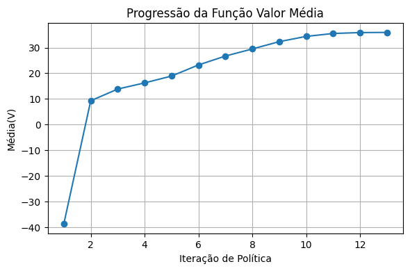

# 🚖 Reinforcement Learning no Ambiente Taxi-v3

Este projeto apresenta uma abordagem de **Aprendizado por Reforço (Reinforcement Learning)** para resolver o ambiente **Taxi-v3** do Gym utilizando o algoritmo **Programação Dinâmica**. O problema é modelado como um **Processo de Decisão de Markov (MDP)** e resolvido com um método tabular.

> Trabalho desenvolvido para a disciplina _Introdução ao Aprendizado por Reforço_ — 2025.

---

## 📌 Objetivo

Modelar o ambiente **Taxi-v3** como um MDP e aplicar **P.D.** para aprender uma política ótima. O resultado é avaliado com base na função valor, função valor-ação e desempenho do agente.

---


---

## 🧮 Método: Iteração de Valores

A **iteração de valores** resolve o MDP ao atualizar a função valor até a convergência:

$$
V_{k+1}(s) = \max_a \sum_{s', r} P(s', r \mid s, a) \left[ r + \gamma V_k(s') \right]
$$

Onde:

- \( V_k(s) \) é a estimativa da função valor no passo \( k \),
- \( \gamma \) é o fator de desconto,
- \( P(s', r \mid s, a) \) é a probabilidade de transição,
- \( r \) é a recompensa recebida na transição de \( s \) para \( s' \) após a ação \( a \).

---

## 📊 Resultados

### 📈 Convergência da Função Valor


---

### 🧭 Política Ótima Derivada


---


## ⚙️ Como Executar

1. Clone o repositório:
   ```bash
   git clone https://github.com/seu-usuario/taxi-v3-dp.git
   cd taxi-v3-dp
2. Instale as dependências
   ```bash
   pip install -r requirements.txt
3. Rode o Jupyter notebook
   ```bash
   jupyter notebook tp_1.ipynb
